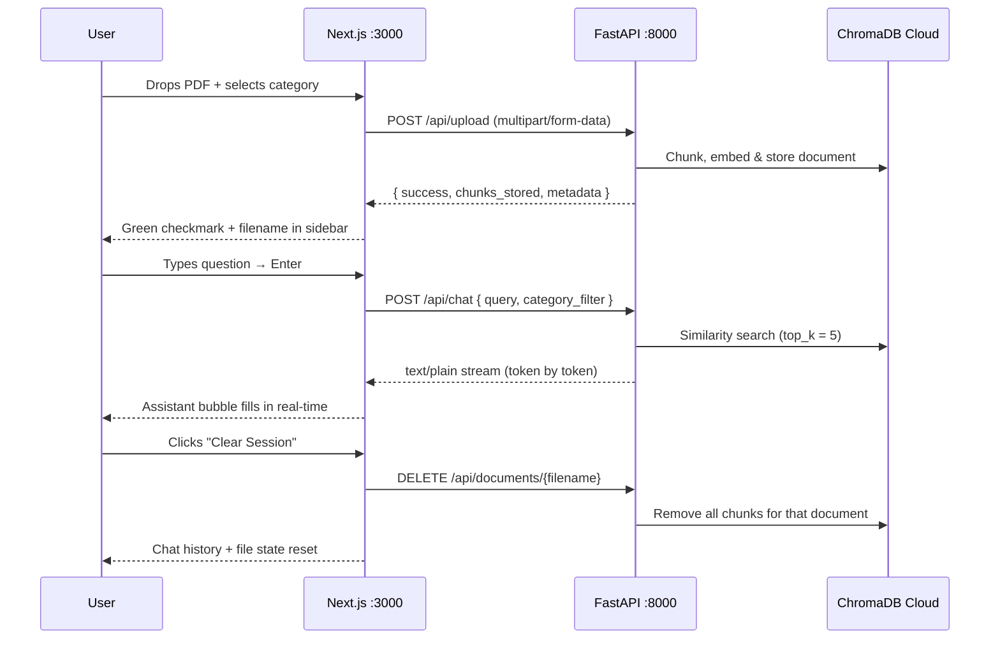

# RAG App Enhanced Frontend

A sleek, streaming-capable Next.js chat interface for the [RAG-Enhanced-Chat-with-pdf](../RAG-Enhanced-Chat-with-pdf/) FastAPI backend. Upload any PDF, pick a category, and chat with its contents — responses stream in token-by-token directly from the backend.

---

## Tech Stack

| Layer | Technology |
|---|---|
| Framework | [Next.js 15](https://nextjs.org/) (App Router) |
| Language | TypeScript 5 |
| Styling | Tailwind CSS 3 |
| Animation | Framer Motion 12 |
| Markdown | react-markdown + remark-gfm + remark-math + rehype-katex |
| Code highlighting | react-syntax-highlighter (Prism / One Dark) |
| Icons | lucide-react |
| API transport | Fetch Streams API (native browser) |

---

## Project Structure

```
rag-app-enhanced-frontend/
├── app/
│   ├── globals.css          # Tailwind base + custom markdown styles
│   ├── layout.tsx           # Root layout
│   └── page.tsx             # Entry point → renders <RagChatShell>
├── components/
│   ├── rag-chat-shell.tsx   # ★ Main orchestrator (upload / chat / clear state)
│   ├── sidebar.tsx          # File upload drop-zone, category selector, clear button
│   ├── chat-header.tsx      # App bar; progress bar animates only while streaming
│   ├── message-bubble.tsx   # User + assistant bubbles, Markdown + LaTeX rendering
│   ├── source-card.tsx      # Citation pill with hover preview
│   └── typing-skeleton.tsx  # Animated loading indicator
├── lib/
│   ├── api.ts               # ★ API client (uploadPdf, streamChat, deleteDocument)
│   ├── mock-data.ts         # Shared types: ChatMessage, Citation
│   └── utils.ts             # cn() class-name helper
├── .env.local               # NEXT_PUBLIC_API_URL (git-ignored)
└── next.config.ts
```

---

## Environment Configuration

Create a `.env.local` file in the project root (already included, git-ignored):

```bash
NEXT_PUBLIC_API_URL=http://localhost:8000
```

Change the URL if your backend runs on a different host or port (e.g. a deployed server).

---

## Getting Started

### Prerequisites

- **Node.js** 18+
- The **FastAPI backend** running at `http://localhost:8000`  
  See [RAG-Enhanced-Chat-with-pdf](../RAG-Enhanced-Chat-with-pdf/README.md) for backend setup.

### Install dependencies

```bash
npm install
```

### Run in development

```bash
npm run dev
```

Open [http://localhost:3000](http://localhost:3000).

### Production build

```bash
npm run build
npm start
```

---

## Running Both Services Locally

Open two terminals side by side:

**Terminal 1 — Backend (FastAPI)**

```bash
cd ../RAG-Enhanced-Chat-with-pdf
uv run python server.py
# API: http://localhost:8000
# Swagger UI: http://localhost:8000/docs
```

**Terminal 2 — Frontend (Next.js)**

```bash
npm run dev
# UI: http://localhost:3000
```

---

## How It Works

### Data flow



### API client (`lib/api.ts`)

| Function | Method | Endpoint | Purpose |
|---|---|---|---|
| `uploadPdf(file, category)` | `POST` | `/api/upload` | Multipart upload; returns chunk count |
| `streamChat(query, filter, onToken)` | `POST` | `/api/chat` | Streams `text/plain` tokens via Fetch Streams |
| `deleteDocument(filename)` | `DELETE` | `/api/documents/{filename}` | Removes document chunks + clears RAG session |

### Streaming response

The backend returns `StreamingResponse(media_type="text/plain")`. The frontend reads the response body as a `ReadableStream` and calls `onToken(chunk)` for each decoded chunk, appending it to the live assistant message in state — giving a real-time typing effect with no WebSocket required.

---

## Key UI Features

- **Drag & drop or click to upload** — hidden `<input type="file" accept=".pdf">` triggered from the styled drop zone
- **Category selector** — choose from Research Paper / Receipt / Technical Doc / Report / Other before uploading; sent as `category` to the backend
- **Streaming chat** — responses appear word-by-word; the header progress bar animates only while a stream is active
- **Animated auto-scroll** — Framer Motion spring scroll on each new message
- **Markdown + LaTeX rendering** — full GFM tables, fenced code blocks with syntax highlighting, and KaTeX math
- **Error banner** — upload or chat errors surface as a dismissible rose-tinted banner
- **Empty state** — friendly prompt shown before any document is loaded
- **Keyboard shortcuts** — `Enter` to send, `Shift+Enter` for a new line; textarea auto-resizes up to 160 px

---

## Customising the Backend URL

If the backend is deployed (not localhost), update `.env.local`:

```bash
NEXT_PUBLIC_API_URL=https://your-backend-domain.com
```

No code changes needed — all three API functions in `lib/api.ts` read from `process.env.NEXT_PUBLIC_API_URL`.